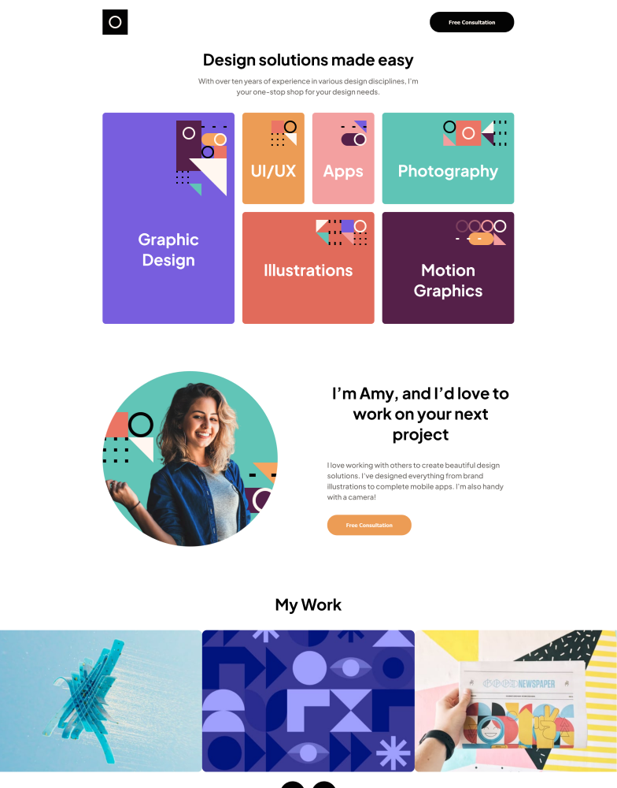

# Frontend Mentor - Single-page design portfolio solution

This is a solution to the [Single-page design portfolio challenge on Frontend Mentor](https://www.frontendmentor.io/challenges/singlepage-design-portfolio-2MMhyhfKVo).

## Table of contents

- [Overview](#overview)
  - [The challenge](#the-challenge)
  - [Screenshot](#screenshot)
  - [Links](#links)
- [My process](#my-process)
  - [Built with](#built-with)
  - [What I learned](#what-i-learned)

## Overview

### The challenge

Users should be able to:

- View the optimal layout for the site depending on their device's screen size
- See hover states for all interactive elements on the page
- Navigate the slider using either their mouse/trackpad or keyboard

### Screenshot

### Links

- Live Demo: [View Live Demo](https://troy71.github.io/single-page-design-portfolio/)
- GitHub Repo: [View Repository](https://github.com/troy71/single-page-design-portfolio)

## My process

### Built with

- Semantic HTML5 markup
- CSS custom properties
- Flexbox
- CSS Grid
- Mobile-first workflow
- Vanilla JavaScript

### What I learned

Working through this project helped reinforce responsive layout techniques using CSS Grid for the skills bento-grid section and building an accessible image slider with keyboard navigation support.
